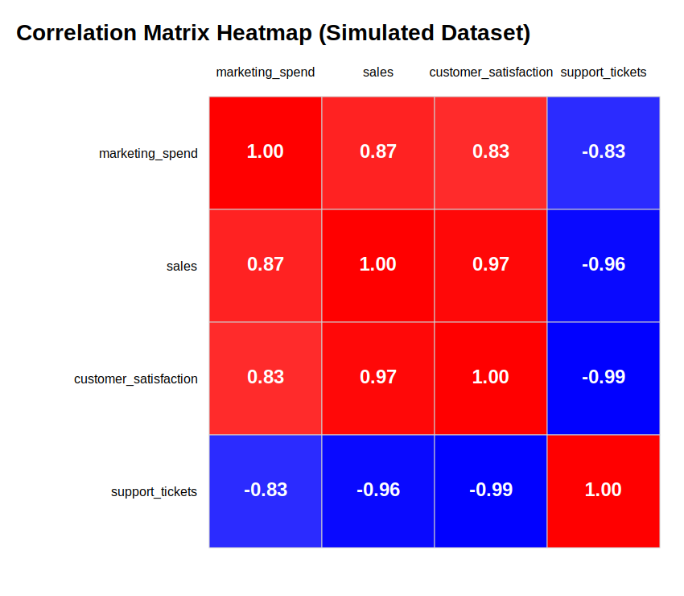

# 15 — Corrélations 

---

# Corrélations : principe et calcul

---

## Plan du chapitre corrélations

1. Comprendre le coefficient de Pearson
2. Construire un dataset simulé cohérent
3. Calculer la matrice de corrélation
4. Visualiser la matrice avec une heatmap
5. Interpréter les relations utiles métier
6. Réaliser un exercice final de synthèse

---

> Mesurer l'intensité et le sens des relations entre variables quantitatives d'un dataset étudié.

---

## Coefficient de corrélation (Pearson)

`r \in [-1 ; 1]`

- **+1** → relation linéaire positive forte
- **0** → absence de relation linéaire
- **−1** → relation linéaire négative forte

---

# Exemple simple : dataset simulé


```python

np.random.seed(42)

# Création d'un petit dataset simulé
df = pd.DataFrame({
    "marketing_spend": np.random.normal(100, 15, 100),
})

# Création de variables corrélées
df["sales"] = df["marketing_spend"] * 2.5 + np.random.normal(0, 20, 100)
df["customer_satisfaction"] = df["sales"] * 0.05 + np.random.normal(3, 0.5, 100)
df["support_tickets"] = 200 - df["customer_satisfaction"] * 20 + np.random.normal(0, 5, 100)

df.head()
```

---

Structure logique simulée :

- Marketing → influence positive sur ventes
- Ventes → influence positive sur satisfaction
- Satisfaction → influence négative sur tickets support

---

## Calcul de la matrice de corrélation

```python
corr_matrix = df.corr(numeric_only=True)
print(corr_matrix)
```

---

##  Visualisation Heatmap

```python

plt.figure(figsize=(8, 6))

sns.heatmap(
    corr_matrix,
    annot=True,
    fmt=".2f",
    cmap="coolwarm",
    square=True,
    linewidths=0.5
)

plt.title("Correlation Matrix Heatmap")
plt.tight_layout()
plt.show()
```

---

## Rendu attendu



---

## Lecture attendue

- `marketing_spend` ↔ `sales` → corrélation positive forte

**Si marketing_spend augmente, sales augmente quasi proportionnellement.**

- `sales` ↔ `customer_satisfaction` → positive modérée

**Les ventes influencent la satisfaction, mais d'autres facteurs jouent également.**

- `customer_satisfaction` ↔ `support_tickets` → négative forte

**Une meilleure satisfaction réduit fortement la charge support.**

```python
sales = marketing_spend * 2.5 + bruit
customer_satisfaction = sales * 0.05 + bruit
support_tickets = 200 - customer_satisfaction * 20 + bruit
```

---

## Exercice final — Corrélations (synthèse)

### Consigne

1. Reprenez le `df` simulé de ce chapitre.
2. Ajoutez deux variables:
   - `discount_rate = 50 - sales * 0.08 + bruit`
   - `returns = 30 - customer_satisfaction * 2 + bruit`
3. Calculez la nouvelle matrice de corrélation.
4. Produisez une heatmap annotée (`vmin=-1`, `vmax=1`).
5. Rédigez 4 lignes d'interprétation métier.

---

## Critères de réussite

- Le code génère une matrice lisible et correcte.
- Au moins 2 corrélations fortes sont identifiées.
- L'interprétation précise bien: corrélation != causalité.
- Une recommandation opérationnelle concrète est proposée.
